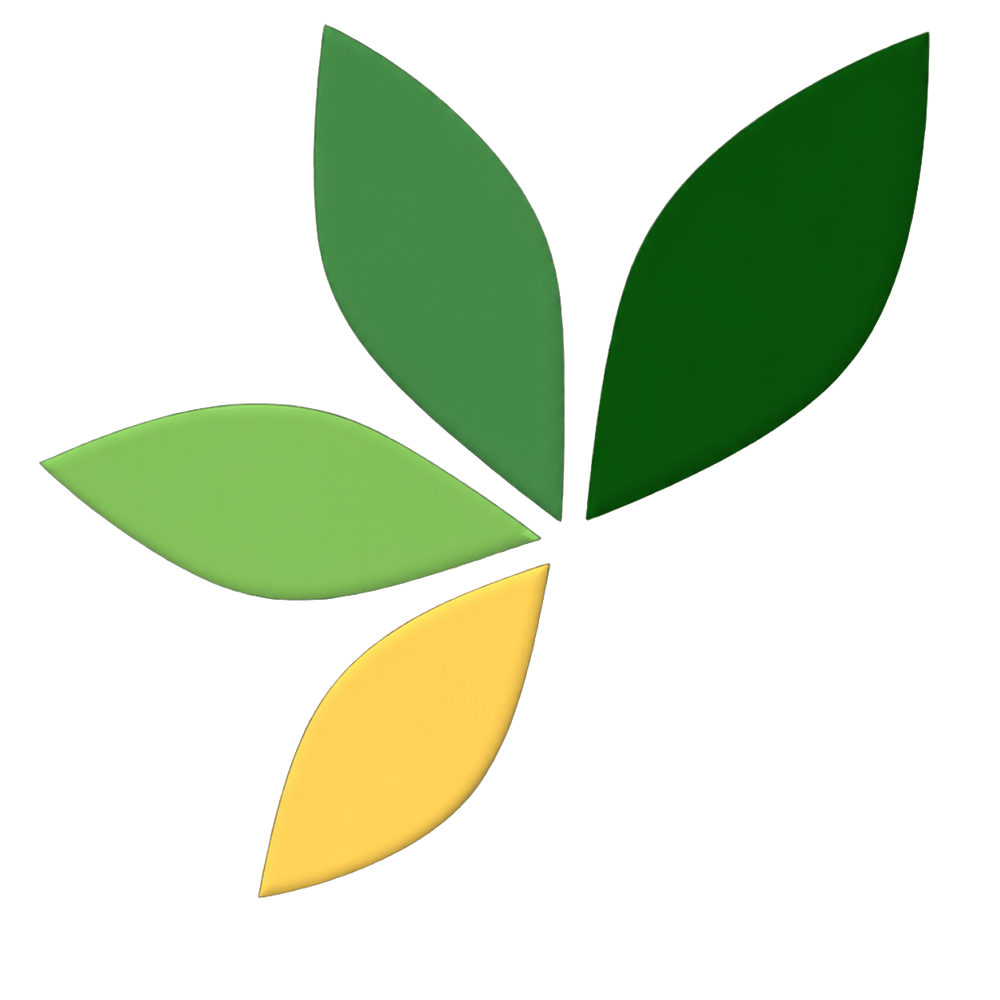

{width=30% fig-align="center"}

Como um nome científico mudou ao longo do tempo? Quando passou a ser considerado sinônimo? Qual é o nome aceito atualmente?

O novo aplicativo Flora e Funga do Brasil — Cronologia transforma diferentes versões da base Flora e Funga do Brasil em uma experiência de consulta simples, visual e informativa.

Pesquise um táxon e acompanhe sua trajetória versão por versão. O aplicativo destaca mudanças de status taxonômico, nomes aceitos, autoria e inclusão ou remoção de sinônimos, além de informar há quanto tempo o registro permanece estável.

No painel analítico, você também pode visualizar a evolução dos dados ao longo das versões, comparar quantidades de registros, nomes aceitos, sinônimos, famílias e gêneros e aplicar filtros por grupo taxonômico, estado, endemismo, origem, domínio fitogeográfico, tipo de vegetação e muito mais.

E o melhor: o aplicativo reúne dados atualizados e as versões mais recentes da Flora e Funga do Brasil, facilitando tanto consultas rápidas quanto análises históricas mais detalhadas.

Explore o passado, acompanhe as mudanças e descubra o estado atual da biodiversidade brasileira.

Acesse o Flora e Funga do Brasil — Cronologia e veja a história por trás de cada nome.

[https://lsbjordao-ffb-cronologia.hf.space//](https://lsbjordao-ffb-cronologia.hf.space/)
