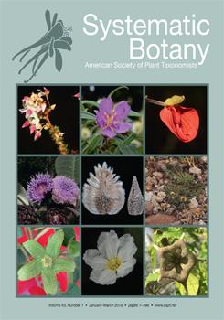

{width=30% fig-align="center"}

This study is a taxonomic treatment of *Mimosa* from the state of Rio de Janeiro, a significant region of the Atlantic Domain in southeastern Brazil. We recognize 36 species (38 taxa), corresponding to 31% of the Mimosa species listed for the domain.

[https://doi.org/10.1600/036364418X696905](https://doi.org/10.1600/036364418X696905)
