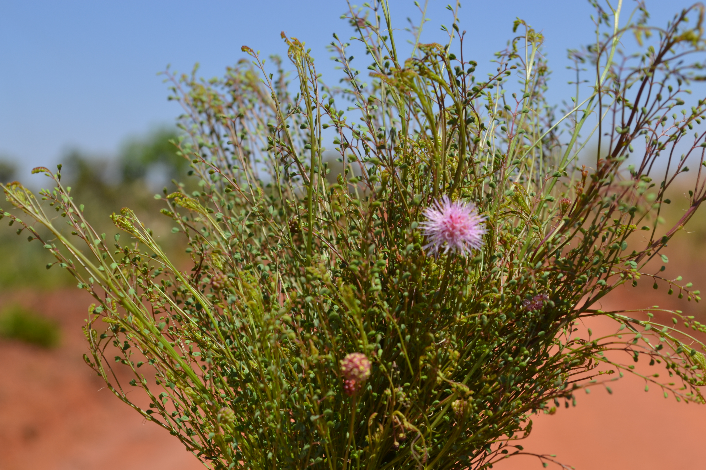

{width=50% fig-align="center"}

Four new species from Brazil are described: *Mimosa afranioi*, *M. emaensis*, *M. robsonii* and *M. sevilhae*.

[https://doi.org/10.1600/036364421X16231782047271](https://doi.org/10.1600/036364421X16231782047271)
