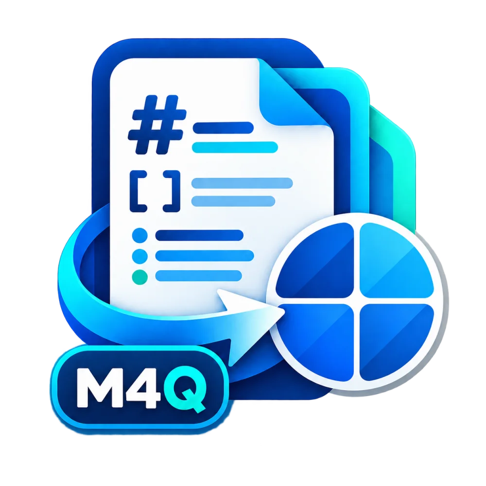

{width=30% fig-align="center"}

I just released **Markdown 4 Quarto**, a VS Code extension that brings Quarto- and Pandoc-oriented scientific authoring features to the native Markdown preview while keeping `.md` as the primary writing surface. It adds alerts, footnotes, cross-references, BibTeX citations with CSL formatting, automatic bibliographies, project variables, and Quarto-style equation labels without replacing the built-in preview.

The workflow separates writing from publishing: draft lightweight sections in Markdown with VS Code's synchronized preview and source navigation, then include them in a `.qmd` file when Quarto needs to produce HTML, PDF, or DOCX. This preserves the built-in authoring loop while leaving document-level composition and final output to Quarto.

<https://marketplace.visualstudio.com/items?itemName=lsbjordao.markdown-4-quarto>
