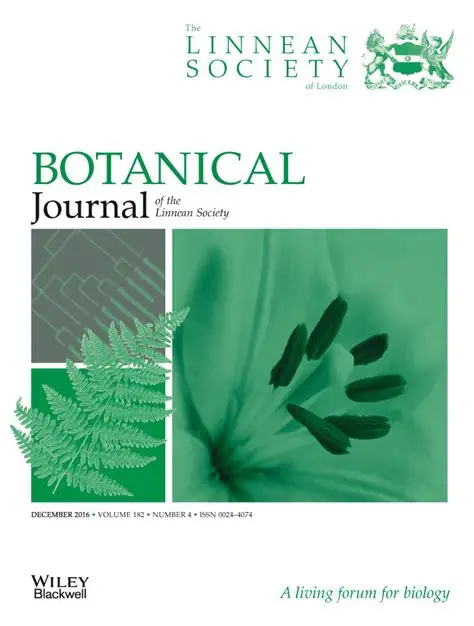

{width=50% fig-align="center"}

This study presents a comprehensive analysis of the phylogeny and biogeography of the *Petiolovariabilis* clade within the genus *Mimosa* (Fabaceae). The authors used molecular data to reconstruct the evolutionary history of this group and to infer its biogeographic patterns.

[https://doi.org/10.1093/sysbio/syaa096](https://doi.org/10.1093/sysbio/syaa096)
