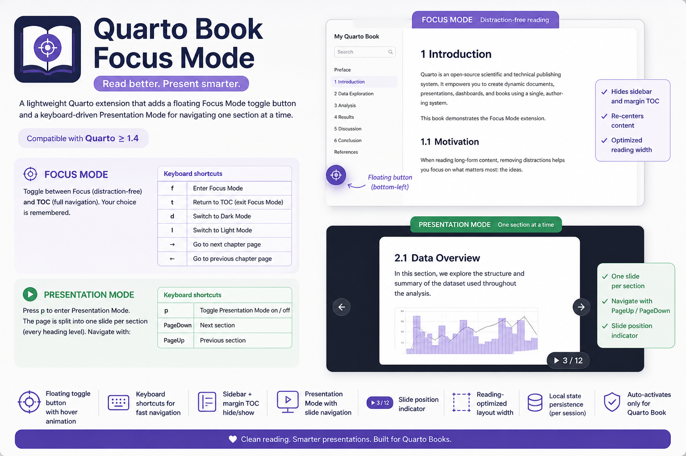

{fig-align="center"}

I just released a Quarto extension that makes book-style and website-style content feel polished and intentional: a floating Focus Mode toggle, section-based Presentation Mode, keyboard navigation, and a smarter chapter progress bar. The impact is immediate: fewer distractions for readers, smoother flow for presenters, and a much better overall reading experience. It follows the user’s theme, remembers preferences in the browser, and plugs into Quarto with minimal setup. If you publish docs, course material, or technical books with Quarto, this is a small change that delivers a big UX upgrade.

<https://github.com/lsbjordao/quarto-focus-mode>
