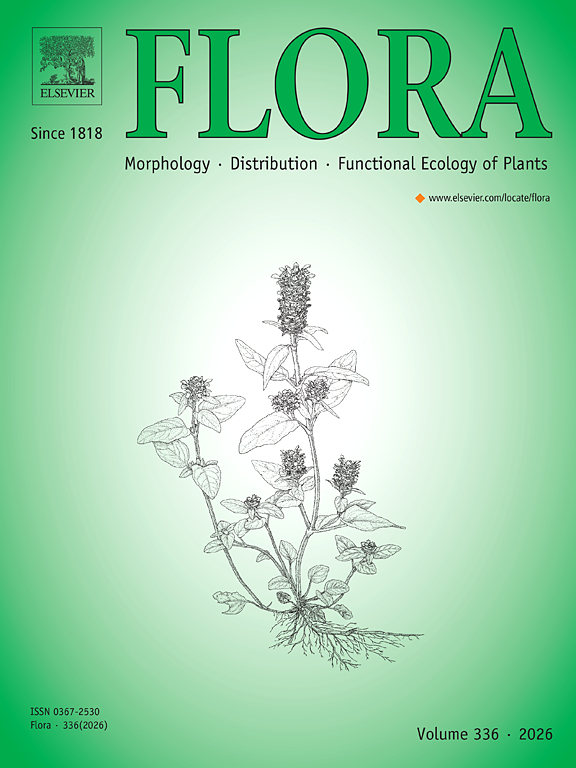

{width=50% fig-align="center"}

This study presents a comprehensive analysis of the trichome characteristics in *Mimosa* (Leguminosae). The authors aimed to characterize and standardize the terminology used to describe trichomes in this genus.

[https://doi.org/10.1016/j.flora.2020.151702](https://doi.org/10.1016/j.flora.2020.151702)
